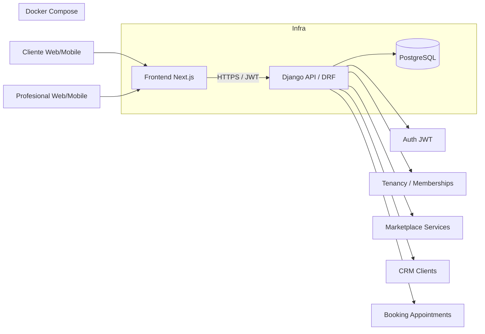
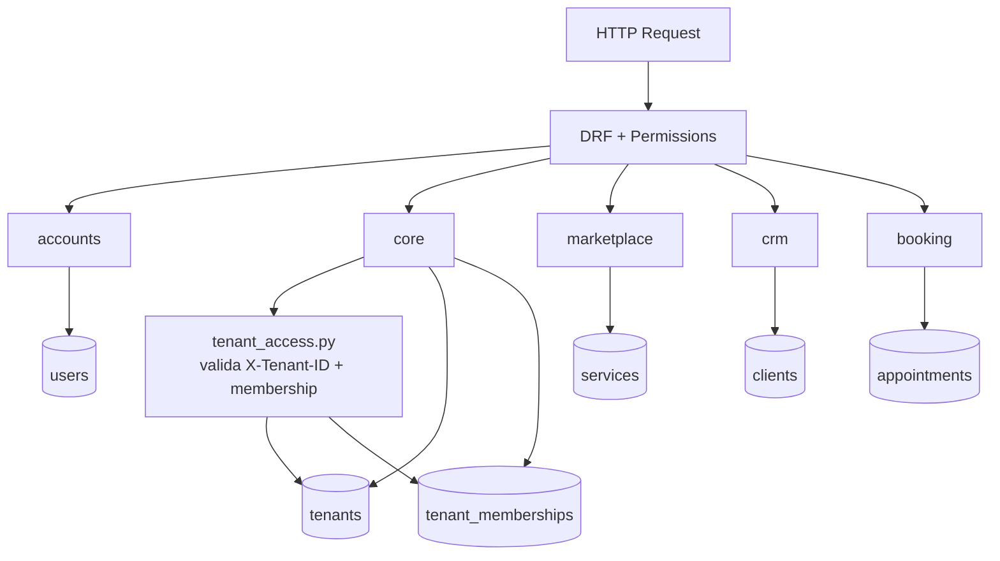
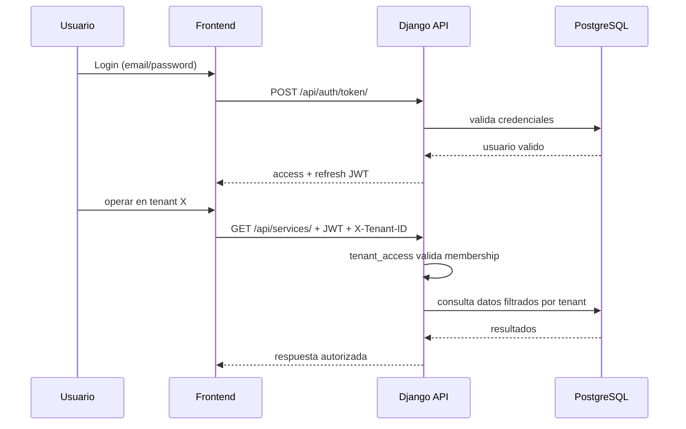
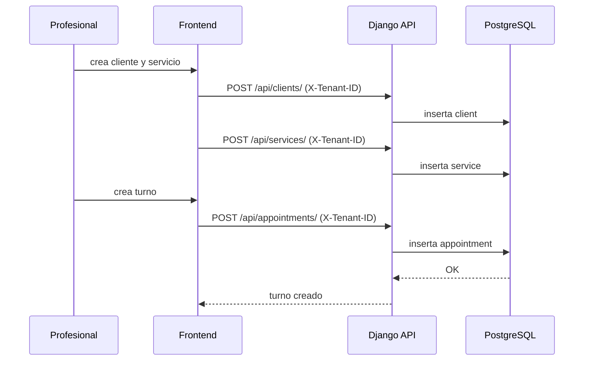
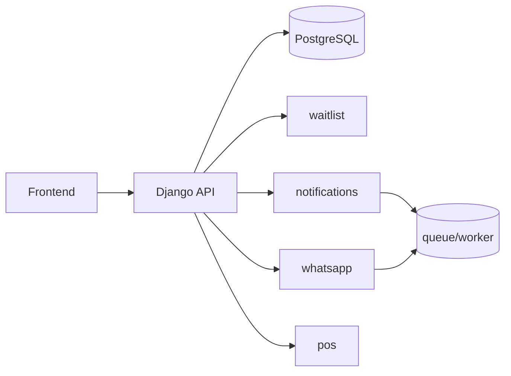

# Conexion Logica De Componentes - NILA MVP

Estado: `MVP 1.0-alpha`

Este documento muestra la conexion logica entre componentes del sistema.

## 1) Vista de contexto (alto nivel)

## 2) Vista interna backend (modular)

## 3) Flujo de autenticacion y acceso por tenant

## 4) Flujo de negocio MVP (reserva de turno)

## 5) Vista objetivo proxima iteracion

## 6) Leyenda
- `X-Tenant-ID`: encabezado obligatorio en endpoints de negocio.
- `JWT`: autenticacion de usuario.
- `tenant_memberships`: define acceso de usuario a empresa/tenant.

## 7) Mantenimiento
Actualizar este diagrama cuando cambie:
- estructura de modulos backend,
- estrategia de integracion frontend,
- nuevos servicios (waitlist, whatsapp, pos, workers).
