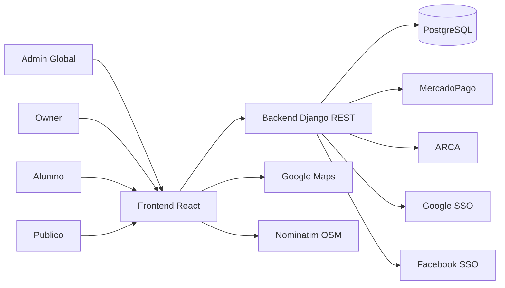
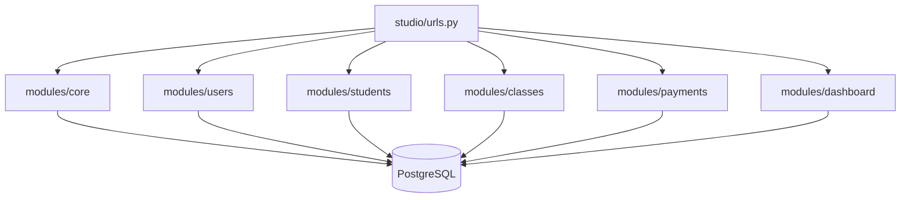
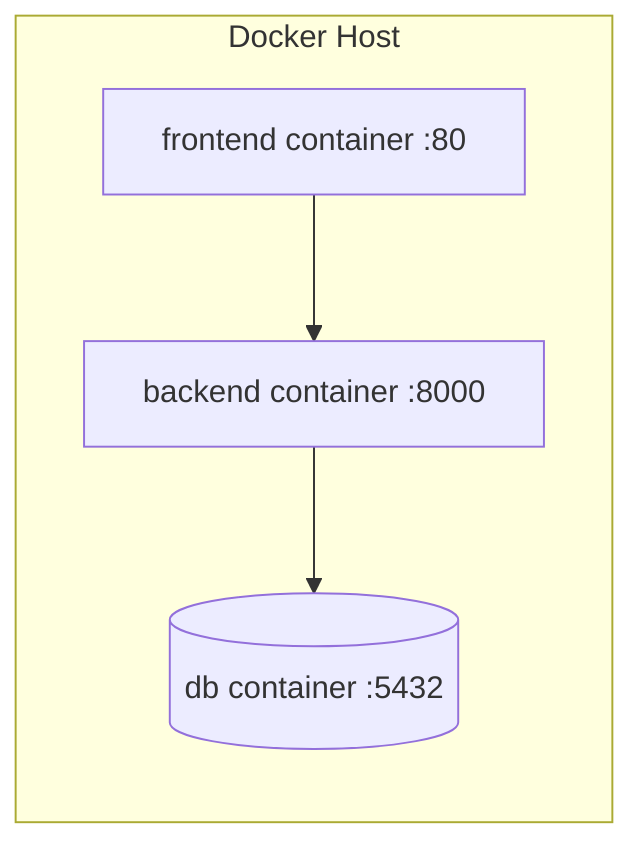
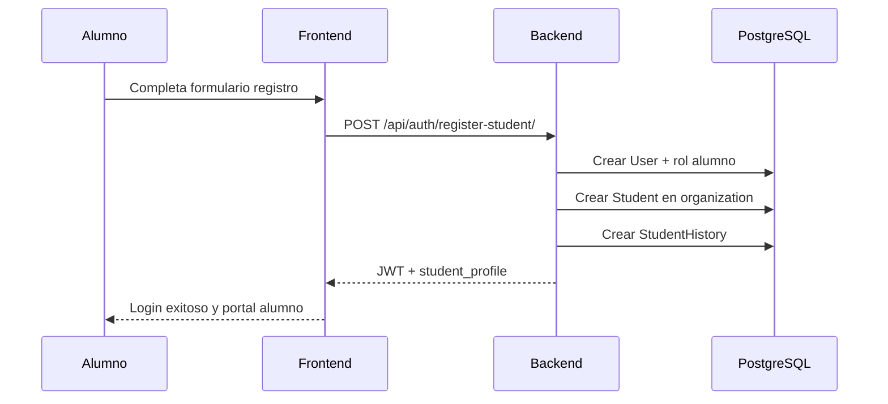
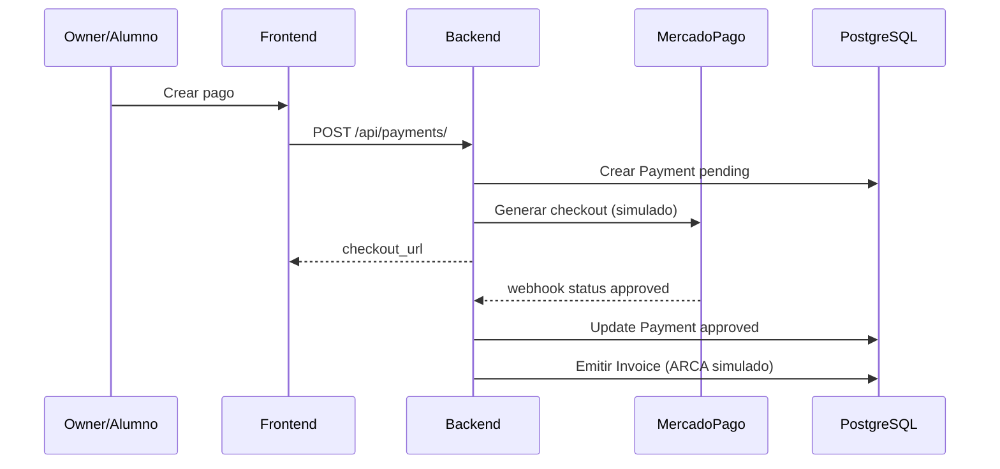

# Manual de Arquitectura - NILA
Version: `1.0`
Fecha: `2026-03-11`

## 1. Vista de contexto
NILA conecta actores de negocio (admin global, owners, alumnos, instructores) con servicios de gestion operativa y comercial.



## 2. Vista logica backend (modular)


Principios:
- Cada dominio concentra reglas y validaciones propias.
- El router central solo compone endpoints.
- Los modelos se exportan en `studio/models.py` para compatibilidad.

## 3. Vista de despliegue (Docker)


## 4. Vista de portales
```mermaid
flowchart LR
  Login[/login] --> Me[GET /api/auth/me]
  About[/quienes-somos]
  Pricing[/precios-planes]
  About --> Login
  Pricing --> Login
  Me -->|portal=platform_admin| Admin[/admin]
  Me -->|portal=owner| Owner[/owner]
  Me -->|portal=student| Student[/student]
  Publico[/descubrir-centros] --> Marketplace[GET /api/auth/marketplace-organizations]
```

Rutas publicas implementadas:
- `/login`
- `/descubrir-centros`
- `/quienes-somos`
- `/precios-planes`

## 5. Modelo de datos (resumen)
Entidades y relaciones principales:
- Organization 1..N Establishment
- Establishment 1..N Room
- Organization N..N User (via OrganizationMembership)
- Organization 1..N Student
- Student N..N Establishment
- Student 1..N StudentHistory
- Organization 1..N StudioClass
- StudioClass N..1 Room
- Organization 1..N MembershipPlan
- Organization 1..N Payment
- Payment 1..0..1 Invoice

## 6. Secuencia: registro de alumno marketplace


## 7. Secuencia: pago y comprobante


## 8. Arquitectura frontend
Estado actual:
- `App.jsx` centraliza rutas, estado global, vistas de portales y vistas publicas.
- `App.css` concentra estilos y responsive.
- El menu publico unifica navegacion comercial y acceso:
  - `Quienes somos`
  - `Precios y planes`
  - `Login empresas`
  - `Login alumnos`
  - `Buscar tu centro mas cercano`

Mejora sugerida:
- Separar por carpetas (`pages`, `modules`, `shared/components`, `services/api`).
- Reducir acoplamiento de estado en componente monolitico.

## 9. Decisiones de arquitectura
- JWT para API stateless.
- Modulos backend por dominio (mantenibilidad).
- Compose para velocidad de despliegue MVP.
- Integraciones externas desacopladas via servicios.

## 10. Riesgos arquitectonicos actuales
- Frontend monolitico dificulta escalado funcional.
- DB en contenedor para MVP (no ideal para produccion).
- Integraciones de pago/factura en modo simulado.

## 11. Evolucion propuesta
1. Refactor frontend modular.
2. RDS + backup administrado.
3. Observabilidad centralizada.
4. CI/CD completo con ambientes.
5. Escalado a ECS/Fargate.
